# GitHub Actions Workflows Documentation

This document describes the automated CI/CD pipeline that handles code quality, testing, versioning, and deployment through four interconnected workflows.

## Pipeline Flow

```mermaid
graph TD
    A[Push to Feature Branch] -->|Triggers| B[test.yml<br/>Quick Test]
    C[Push/PR to main] -->|Triggers| D[ci.yml<br/>Full CI Suite]
    D -->|On Success| E[version_release.yml<br/>Version Check & Tag]
    E -->|Creates Tag| F[release.yml<br/>Publish Release]
    
    B -->|Pass| G[Ready for Main]
    F --> H[🚀 PyPI + Docker + GitHub Release]
    
    style A fill:#e1f5fe
    style C fill:#e1f5fe
    style B fill:#fff3e0
    style D fill:#f3e5f5
    style E fill:#e8f5e8
    style F fill:#ffebee
    style G fill:#f1f8e9
    style H fill:#e3f2fd
```

**Legend:**
- 🔵 Blue: Trigger events (code pushes)
- 🟠 Orange: Feature branch validation
- 🟣 Purple: Main branch CI
- 🟢 Green: Version management
- 🔴 Red: Release & deployment
- ✅ Light colors: Outcomes

## Workflow Details

### 1. Feature Branch Test (`test.yml`)
**Purpose**: Quick validation before merging to main

**Triggers**: Push to any branch except `main` (only when Python/config files change)
**Actions**: 
- Sets up Python 3.11 on Ubuntu
- Installs dependencies with retry logic
- Runs pytest with caching

### 2. CI Workflow (`ci.yml`)
**Purpose**: Comprehensive testing on main branch

**Triggers**: Pull requests, pushes to `main`, manual dispatch
**Key Jobs**:
- **Lint**: Black formatting + Ruff linting
- **Test Matrix**: Multi-platform (Ubuntu/Windows/macOS) and multi-Python (3.11-3.13)
- **Coverage**: Reports to Codecov

### 3. Version Release (`version_release.yml`)
**Purpose**: Auto-creates version tags when `setup.cfg` changes

**Triggers**: Successful CI completion on main
**Process**:
1. **Check Version**: Compares setup.cfg version with latest git tag
2. **Validate Format**: Ensures PEP 440 compliance (X.Y.Z, X.Y.ZdevN, etc.)
3. **Create Tag**: Makes annotated git tag (triggers release workflow)

### 4. Release Workflow (`release.yml`)
**Purpose**: Publishes releases across platforms

**Triggers**: Version tag creation (auto) or manual dispatch
**Parallel Jobs**:
- **PyPI**: Publishes Python package using trusted publishing
- **Docker**: Builds base + MCP server images → Google Artifact Registry
- **GitHub**: Creates release with auto-generated notes and install instructions

## Key Features

**Smart Automation**:
- Only releases when version actually changes
- Automatic prerelease detection (dev/alpha/beta/rc versions)
- Fail-fast testing before expensive operations

**Robust Infrastructure**:
- Multi-platform testing matrix
- Dependency caching and retry logic
- Parallel job execution where possible

**Security & Best Practices**:
- OIDC trusted publishing (no API keys)
- Conditional job execution
- Comprehensive error handling

## Manual Override Options

The release workflow supports manual triggering with optional controls:
- `version`: Specify release version
- `publish_pypi`: Enable/disable PyPI publication  
- `build_docker`: Enable/disable Docker builds
- `create_github_release`: Enable/disable GitHub releases

## Required Configuration

**Secrets**: 
- `GCP_SA_KEY`: Google Cloud service account for Docker registry
- `GCP_PROJECT_ID`: Google Cloud project ID

**Docker Registry**: `us-west1-docker.pkg.dev` (Google Artifact Registry)
